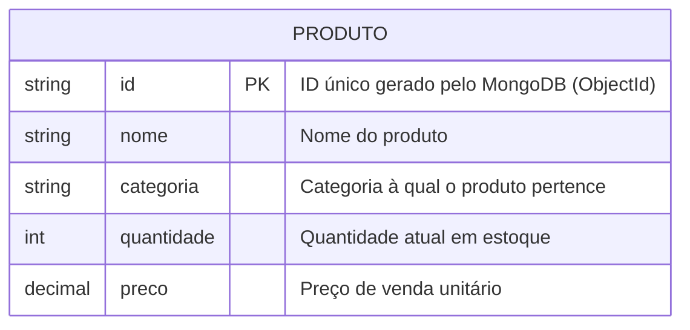

```mermaid
erDiagram
PRODUTO {
string id PK "ID único gerado pelo MongoDB (ObjectId)"
string nome "Nome do produto"
string categoria "Categoria à qual o produto pertence"
int quantidade "Quantidade atual em estoque"
decimal preco "Preço de venda unitário"
}
```