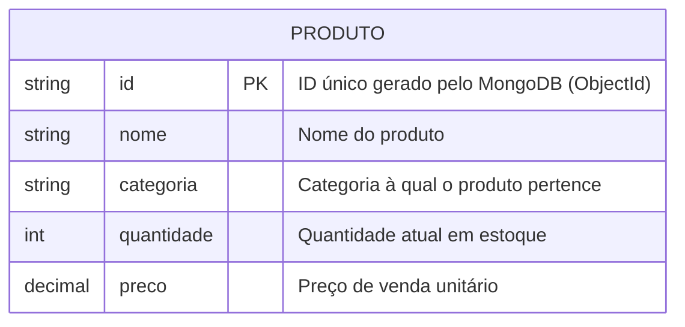

# Estoque API - Borbolêlalá

API RESTful completa para o sistema de gerenciamento de estoque da Borbolêlalá. Este projeto serve como o backend para a aplicação, lidando com toda a lógica de negócio, persistência de dados e regras de estoque.

O sistema foi migrado de uma aplicação Python de terminal para uma arquitetura web moderna, utilizando as tecnologias mais recentes do ecossistema Java.

## ✨ Funcionalidades

* **Gerenciamento de Produtos:** Operações CRUD (Criar, Ler, Atualizar, Deletar) completas para os produtos.
* **Controle de Estoque:** Endpoint dedicado para movimentações de entrada e saída de estoque de forma atômica.
* **Arquitetura Robusta:** Separação clara de responsabilidades em camadas (Controller, Service, Repository).
* **Persistência de Dados:** Utiliza o MongoDB para armazenar os dados de forma flexível e escalável.

## 🚀 Tecnologias Utilizadas

* **Java 25:** Versão mais recente da linguagem Java.
* **Spring Boot 3+:** Framework principal para a construção da API.
* **Gradle 9.0:** Ferramenta de automação de build.
* **Spring Data MongoDB:** Para integração e comunicação com o banco de dados.
* **MongoDB:** Banco de dados NoSQL orientado a documentos, conectado a um cluster na nuvem.
* **Lombok:** Para reduzir código boilerplate (getters, setters, construtores).

## 📋 Pré-requisitos

Antes de começar, você vai precisar ter instalado em sua máquina:
* [JDK (Java Development Kit)](https://www.oracle.com/java/technologies/downloads/) - Versão 25 ou superior.
* [Gradle](https://gradle.org/install/) - Versão 9.0 ou superior (Opcional, pode-se usar o Gradle Wrapper `gradlew`).
* Acesso a um cluster MongoDB (ex: [MongoDB Atlas](https://www.mongodb.com/cloud/atlas)).

## ⚙️ Configuração e Instalação

1.  **Clone o repositório:**
    ```bash
    git clone [https://github.com/SEU_USUARIO/borbolelala-backend.git](https://github.com/SEU_USUARIO/borbolelala-backend.git)
    cd borbolelala-backend
    ```

2.  **Configure as variáveis de ambiente:**
    O projeto utiliza o arquivo `src/main/resources/application.properties` para configurar a conexão com o banco de dados. Certifique-se de que ele contenha as seguintes propriedades, com os seus dados corretos:

    ```properties
    # String de conexão do seu cluster MongoDB Atlas
    spring.data.mongodb.uri=mongodb+srv://<username>:<password>@SEU_CLUSTER.mongodb.net/?retryWrites=true&w=majority

    # Nome do banco de dados que será utilizado no cluster
    spring.data.mongodb.database=borbolela_estoque

    # Nome da aplicação (boa prática)
    spring.application.name=borbolelala-estoque
    ```

## ▶️ Executando a Aplicação

1.  **Via terminal (usando o Gradle Wrapper):**
    ```bash
    ./gradlew bootRun
    ```

2.  **Via IDE (IntelliJ IDEA, VS Code, etc.):**
    * Importe o projeto como um projeto Gradle.
    * Encontre a classe `EstoqueApiApplication.java` e execute o método `main()`.

A API estará disponível em `http://localhost:8080`.

## 📖 Endpoints da API

A base de todos os endpoints é `/api/produtos`.

| Método | Endpoint                    | Descrição                                         | Exemplo de Corpo (Body)                                                                            |
| :----- | :-------------------------- | :------------------------------------------------ | :------------------------------------------------------------------------------------------------- |
| `GET`    | `/`                         | Lista todos os produtos cadastrados.              | N/A                                                                                                |
| `GET`    | `/{id}`                     | Busca um produto específico pelo seu ID.          | N/A                                                                                                |
| `POST`   | `/`                         | Cria um novo produto.                             | `{ "nome": "Saia Tule", "categoria": "Saias", "quantidade": 20, "preco": 79.90 }`                  |
| `PUT`    | `/{id}`                     | Atualiza as informações de um produto existente.  | `{ "nome": "Saia Tule Rosa", "categoria": "Saias", "preco": 85.50 }` (quantidade não é alterada) |
| `DELETE` | `/{id}`                     | Remove um produto do sistema.                     | N/A                                                                                                |
| `PATCH`  | `/{id}/movimentar`          | Adiciona ou remove itens do estoque.              | `{ "quantidade": 10 }` (para entrada) ou `{ "quantidade": -5 }` (para saída)                      |

## 📊 Modelo de Documento Armazenado no Banco de Dado

---
